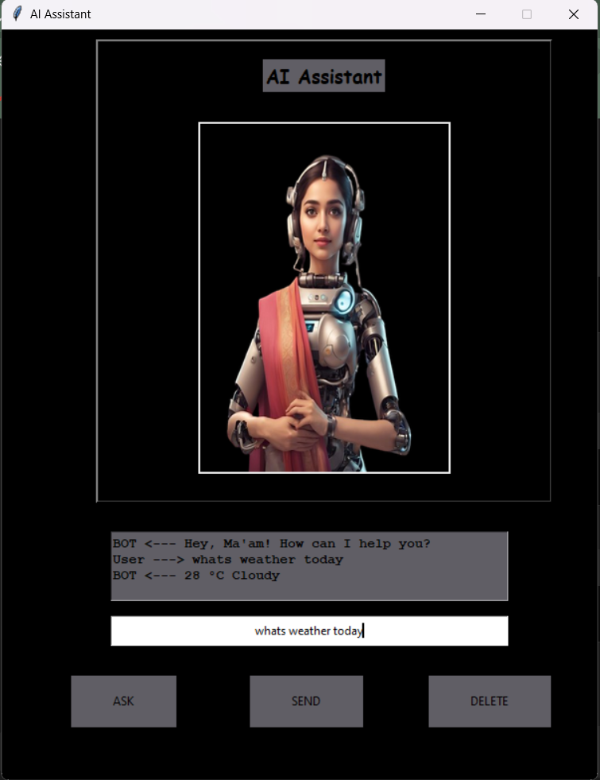

# AI Assistant

An AI assistant that automates your daily tasks through speech and text interactions. You can ask questions via voice or text, and the assistant will respond both through voice and text. It can perform various actions such as opening websites (e.g., Google, Facebook, YouTube) and providing weather updates.

## Features
- **Speech and Text Input**: Communicate with the assistant via speech or text.
- **Voice and Text Output**: Responses are given both in text and voice formats.
- **Automated Tasks**:
  - Open popular websites like Google, Facebook, and YouTube.
  - Provide weather updates for your location.
- **Powered by Python**: Uses Python modules like `speech_recognition`, `pyttsx3`, `requests`, and integrates with OpenAI for advanced text processing.

## Demo


## Technologies Used
- **Python Modules**:
  - `speech_recognition`: For recognizing voice input.
  - `pyttsx3`: For converting text to speech.
  - `requests`: For accessing weather and other API services.
  - `openai`: For advanced text-based responses.
- **APIs**:
  - OpenAI API: For NLP-based responses.
  - Weather API: For weather updates.
  
## Installation

1. Clone the repository:
   ```bash
   git clone <repository-url>
   cd AI-Assistant

